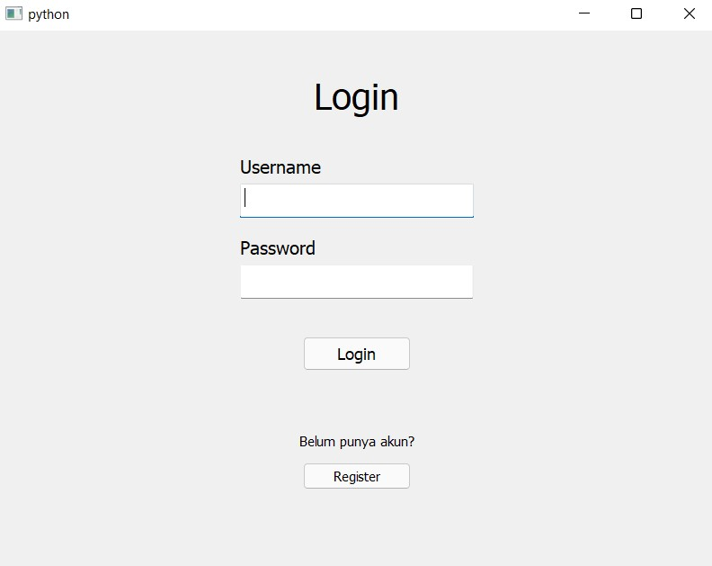
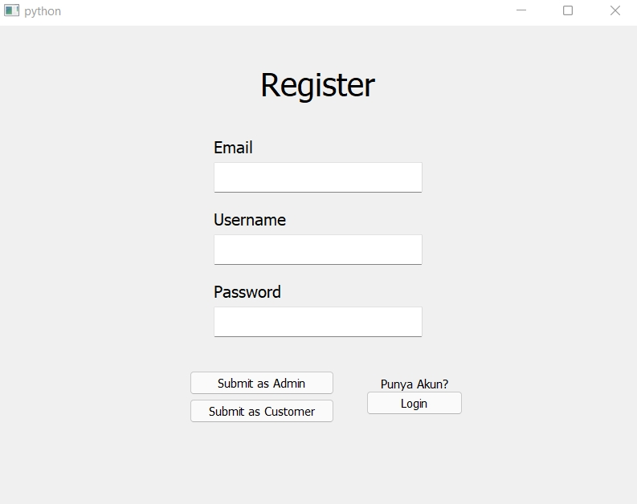
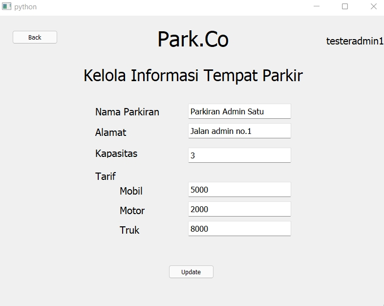
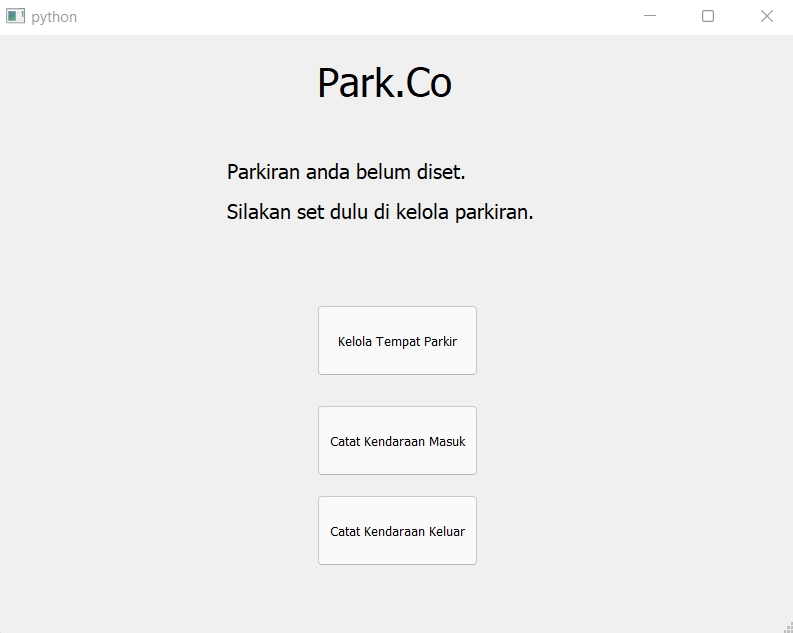
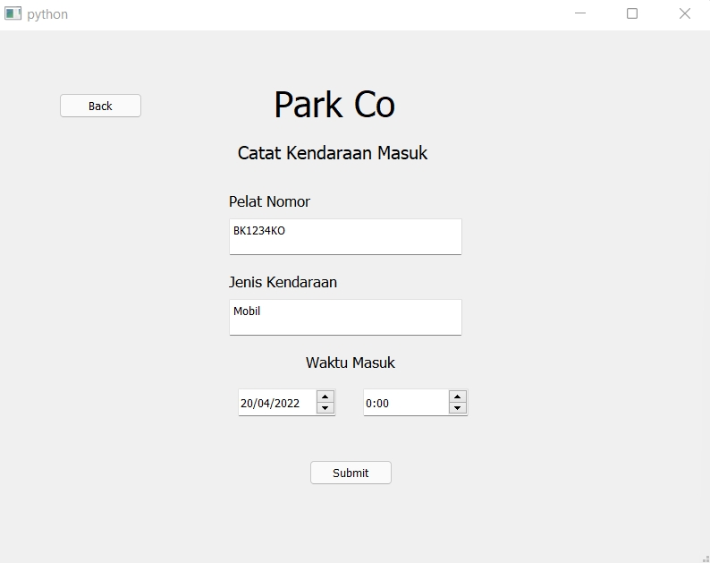
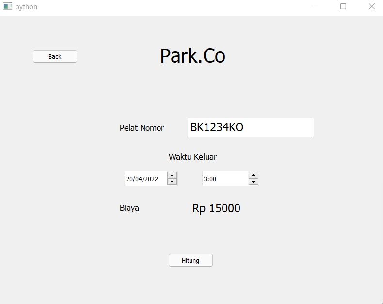
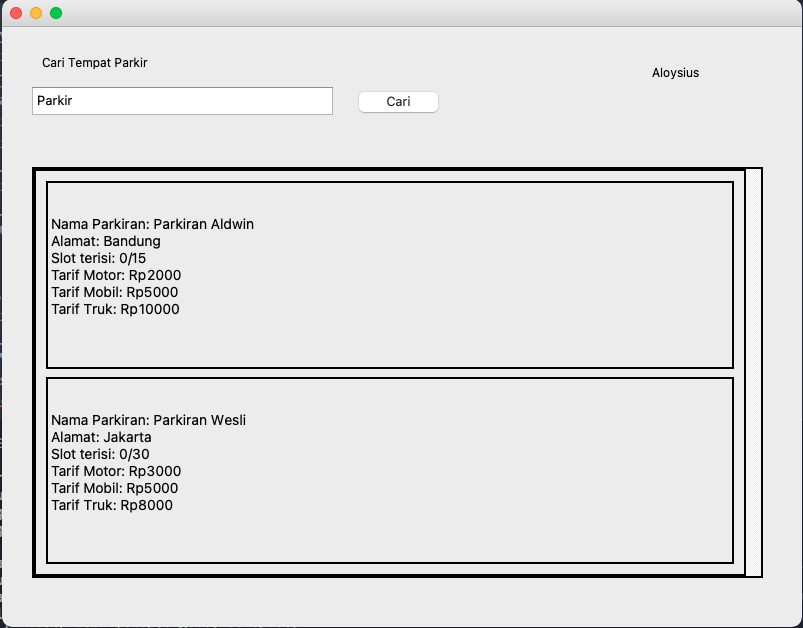

# IF2250-2021-K02-13-Park.<area>Co

> Park.<area>Co adalah sebuah aplikasi berbasis GUI yang berbasis akun, di mana user dapat berupa <em>admin</em> dan <em>customer</em>. <em>Admin</em> dapat mengelola informasi parkiran, mencatat informasi kendaraan yang masuk, dan menghitung berapa biaya kendaraan ketika kendaraan keluar dari tempat parkir. <em>Customer</em> dapat melihat informasi parkiran dengan cara melakukan search nama parkiran.

> User dapat melakukan registrasi terlebih dahulu, sebagai <i>admin</i> atau sebagai <i>customer</i>. Jika user mendaftar sebagai <i>admin</i>, user akan mendapat alokasi tempat parkir yang dapat dikelola di menu kelola info parkiran. User yang mendaftar sebagai <i>customer</i> tidak mendapat alokasi tempat parkir, hanya dapat mencari tempat parkir berdasarkan namanya.

## Prerequisites

Aplikasi ini berbasis basis data MariaDB. Program basis data MariaDB dapat diunduh melalui link https://downloads.mariadb.org. Settings MariaDB adalah sebagai berikut.

-   Port: 3306
-   Hostname: localhost
-   User: root
-   Password: (tidak ada)

Untuk melakukan reset terhadap password MariaDB, jalankan command berikut di dalam client MariaDB.

```
FLUSH PRIVILEGES;
ALTER USER 'root'@'localhost' IDENTIFIED BY '';
```

Aplikasi ini menggunakan beberapa modul eksternal python yang dapat didownload melalui pip, yaitu:

-   PyQt5
-   mariadb

Jalankan command berikut di terminal pada repository ini untuk mengunduh modul di atas.

```bash
pip install -r requirements.txt
```

## Cara Menjalankan Aplikasi

### Setup

1. <em>Clone</em> atau <em>download</em> repository ini.
2. Buka <em>terminal</em> pada repository ini.
3. Untuk me-<i>restore</i> basis data dari `src/parkco.sql`, jalankan command berikut, dimulai dari terminal pada repository ini.

    ```
    mysql -u root

    create database parkco;
    quit

    mysql -u root < src/parkco.sql
    ```

### Run

1. Untuk menjalankan aplikasi, jalankan command berikut di terminal pada repository ini.
    ```
    py src/main_window.py
    ```

## Daftar Modul

<table>
<tr>
    <td align="center"> No </td>
    <td align="center"> Nama Modul </td>
    <td align="center"> Penanggung Jawab</td>
    <td align="center"> Tampilan </td>
</tr>

<tr>
    <td align="center"> 1 </td>
    <td align="center"> Authentication </td>
    <td>GUI : 13520131-Steven <br> CODE : 13520071-Wesly Giovano</td>
    <td align="center">   </td>
</tr>

<tr>
    <td align="center"> 2 </td>
    <td align="center"> Parking Manager </td>
    <td> GUI : 13520131-Steven <br> CODE : 13520131-Steven</td>
    <td align="center">  </td>
</tr>

<tr>
    <td align="center"> 3 </td>
    <td align="center"> Vehicle Manager </td>
    <td> GUI : 13520131-Steven <br> CODE : 13520147-Aloysius Gilang Pramudya</td>
    <td align="center">
        
        
        
    </td>
</tr>

<tr>
    <td align="center"> 4 </td>
    <td align="center"> Parking Search </td>
    <td> GUI : 13520131-Steven <br> CODE : 13520167-Aldwin Hardi Swastia</td>
    <td align="center">  </td>
</tr>

</table>

Daftar modul yang diimplementasi dilengkapi dengan nama modul, NIM dan nama penanggung jawab, dan capture screen tampilan layar (jika ada) permodul

## Basis Data

Aplikasi ini menggunakan basis data MariaDB. Dump basis data yang diimplementasikan terdapat pada `src/parkco.sql`. Berikut adalah skema basis data relasional yang digunakan dalam aplikasi Park.<area>Co dengan tulisan yang di garis-bawahi menunjukkan <i>primary key</i> dari relasi yang bersesuaian.

-   Admin = (<ins>id</ins>, email, username, password, idParkiran)
-   Customer = (<ins>id</ins>, email, username, password)
-   InformasiParkiran = (<ins>idParkiran</ins>, namaParkiran, alamat, kapasitas, tarifMotor, tarifMobil, tarifTruk)
-   Kendaraan = (<ins>idKendaraan</ins>, platNomor, jenis, sedangParkir)
-   KendaraanTerparkir = (<ins>id</ins>, idParkiran, idKendaraan, waktuMasuk, waktuKeluar, biaya, sudahKeluar)
